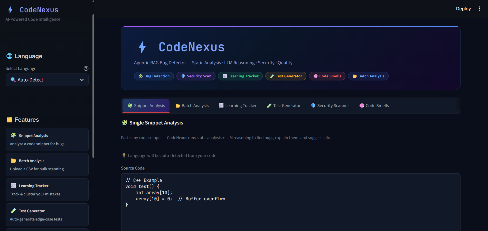
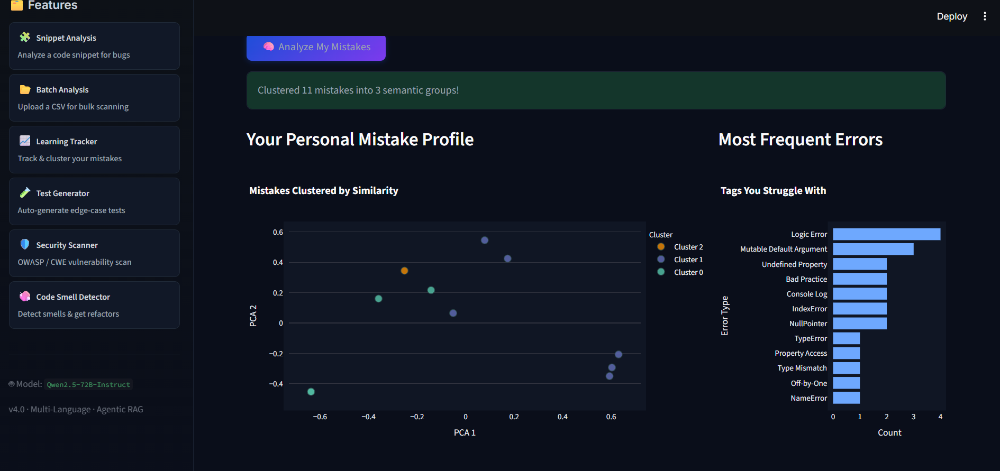

# 🕷️ CodeNexus Agent (Version 4)

**Eliminating Coding Hallucinations with Agentic AI + Static Analysis + RAG.**

Bug Hunter is an advanced AI coding assistant designed for embedded systems. Unlike standard LLMs that guess, Bug Hunter **proves** its fixes by combining:
1.  **Static Analysis** (CppCheck) for mathematical correctness.
2.  **RAG (Retrieval-Augmented Generation)** for proprietary API knowledge.
3.  **Agentic Reasoning** (Qwen 2.5 72B) for high-level logic.




---

## 🚀 Key Features

-   **🚫 Zero Hallucinations**: Fetches real API documentation via RAG before writing a single line of code.
-   **Math-Verified Logic**: Uses `CppCheck` to detect buffer overflows, null pointers, and extensive resource leaks *before* the LLM sees the code.
-   **Agentic Workflow**:
    1.  **Search**: "What is the correct API for `SmartRDI`?"
    2.  **Analyze**: "Does this code have memory leaks?"
    3.  **Judge**: "Based on the docs and static analysis, here is the fix."
-   **Interactive UI**: A hacker-themed Streamlit app with **Diff Views** for instant code verification.
-   **Batch Processing**: Upload a CSV with 1,000+ snippets and get a report in minutes.

---

## 🛠️ Tech Stack

| Component | Technology | Description |
| :--- | :--- | :--- |
| **Brain** | **Qwen 2.5 72B Instruct** | Top-tier open-weight model for coding/logic. |
| **Orchestrator** | **FastMCP** (Python) | Manages the agent loop and tool execution. |
| **Knowledge** | **LlamaIndex** + **HuggingFace** | Vector database for RAG context retrieval. |
| **Static Analysis**| **CppCheck** | Industrial-grade C++ error detection. |
| **Frontend** | **Streamlit** | Interactive web UI for developers. |

---

## ⚡ Quick Start

### Prerequisites
-   Python 3.10+
-   `cppcheck` installed and added to system PATH.
-   A generic Hugging Face API Token.

### Installation

1.  **Clone the Repository**
    ```bash
    git clone https://github.com/yourusername/bug-hunter-agent.git
    cd bug-hunter-agent
    ```

2.  **Install Dependencies**
    ```bash
    pip install -r requirements.txt
    ```
    *(Note: This installs `fastmcp`, `llama-index`, `streamlit`, and other core libs.)*

3.  **Configure Environment**
    Create a `.env` file in the root directory:
    ```ini
    HF_API_KEY=your_huggingface_api_key
    HF_MODEL_ID=Qwen/Qwen2.5-72B-Instruct
    MCP_SERVER_URL=http://localhost:8003/sse
    ```

### Usage

**1. Start the MCP Server (Knowledge Base)**
This server handles RAG and embedding models.
```bash
python mcp_server.py
```

**2. Launch the Bug Hunter UI**
In a new terminal:
```bash
streamlit run app.py
```
Open `http://localhost:8501` in your browser.

---

## 🧠 How It Works (The "Secret Sauce")

1.  **Input**: User provides a code snippet (e.g., `rdi.readHumanSeniority()`).
2.  **RAG Lookup**: The agent searches the vector DB.
    *   *Result*: "Did you mean `rdi.readHumSensor()`? (Confidence: 98%)"
3.  **Static Check**: `CppCheck` scans the code.
    *   *Result*: "Error: Buffer overflow at line 4."
4.  **LLM Synthesis**: The Agent prompts Qwen-72B:
    *   *"Context says `readHumSensor` is correct. CppCheck found an overflow. Fix both."*
5.  **Output**: A concise, verified explanation + corrected code.

## 📂 Project Structure

-   `codenexus_agent.py`: The core agent logic (LLM + RAG + CppCheck integration).
-   `mcp_server.py`: FastMCP server handling vector embeddings and doc search.
-   `app.py`: Streamlit frontend.
-   `utils/cpp_checker.py`: Python wrapper for invoking CppCheck.
-   `utils/code_analyzer.py`: Prompt engineering and response parsing.
-   `data/`: Input/Output CSVs for batch processing.

---

## 🏆 Acknowledgements

Built with ❤️ using **FastMCP**, **LlamaIndex**, and **Streamlit**.
Special thanks to the **Alienbrain** team for the architecture inspiration.
